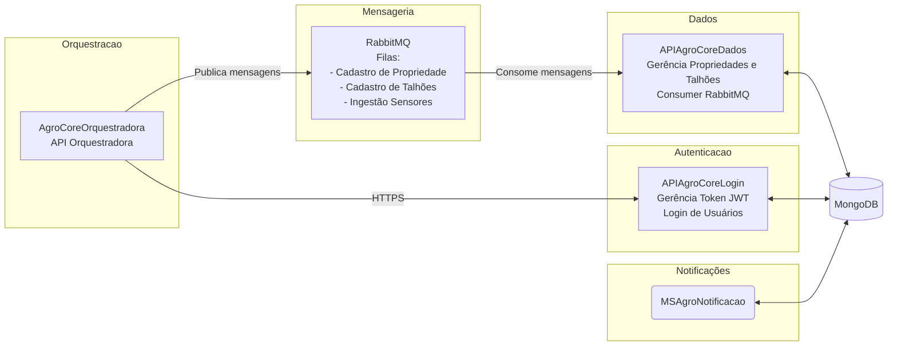
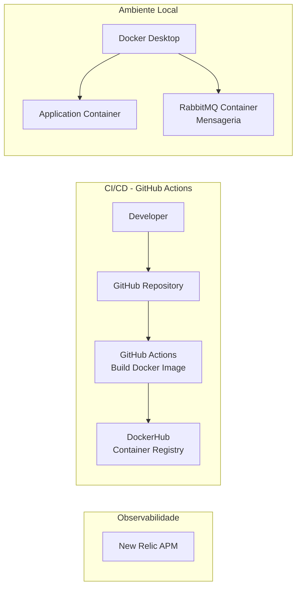

# AgroCore
AgroCore - O núcleo inteligente da agricultura de precisão.

# Fluxo de comunicação entre Microserviços

```mermaid
flowchart LR

    subgraph Orquestracao
        A["AgroCoreOrquestradora<br>API Orquestradora"]
    end

    subgraph Autenticacao
        B["APIAgroCoreLogin<br>Gerência Token JWT<br>Login de Usuários"]
       
    end

    subgraph Mensageria
        D["RabbitMQ<br>Filas:<br>- Cadastro de Propriedade<br>- Cadastro de Talhões<br>- Ingestão Sensores"]
    end

    subgraph Notificações
        F(MSAgroNotificacao)
    end

    subgraph Dados
        E["APIAgroCoreDados<br>Gerência Propriedades e Talhões<br>Consumer RabbitMQ"]
    end

    C[(MongoDB)]
    
    A -->|HTTPS| B
    A -->|Publica mensagens| D
    D -->|Consome mensagens| E
    E <--> C
    B <--> C
    F <--> C

```
# Arquitetura do Solução

```mermaid
flowchart LR

    %% ========================
    %% APM
    %% ========================
    subgraph APM["Observabilidade"]
        NR["New Relic APM"]
    end
    %% ========================
    %% CI/CD
    %% ========================
    subgraph CICD["CI/CD - GitHub Actions"]
        DEV["Developer"]
        GH["GitHub Repository"]
        GA["GitHub Actions<br>Build Docker Image"]
        DH["DockerHub<br>Container Registry"]

        DEV --> GH
        GH --> GA
        GA --> DH
    end


    %% ========================
    %% AMBIENTE LOCAL
    %% ========================
    subgraph LOCAL["Ambiente Local"]

        DD["Docker Desktop"]

        APP["Application Container"]

        MQ["RabbitMQ Container<br>Mensageria"]

        DD --> APP
        DD --> MQ

    end


    %% ========================
    %% FLUXOS
    %% ==========

```
